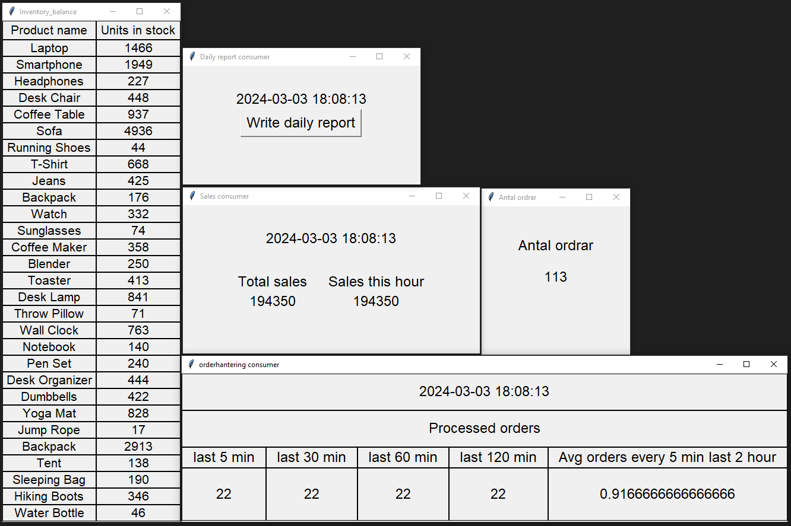

# Apache kafka E-commerce 
This project was made to simulate a E-commerce application that sends and recieve orders with Apache Kafka. The first part of the application works as a producer and consist of a program that creates random orders of products as a dictionary and sends it to a apache kafka topic. The second part of the application works as a consumer and consist of multiple smaller programs that reads from the topic and evaluates and displays different kind of information about the data coming in.

